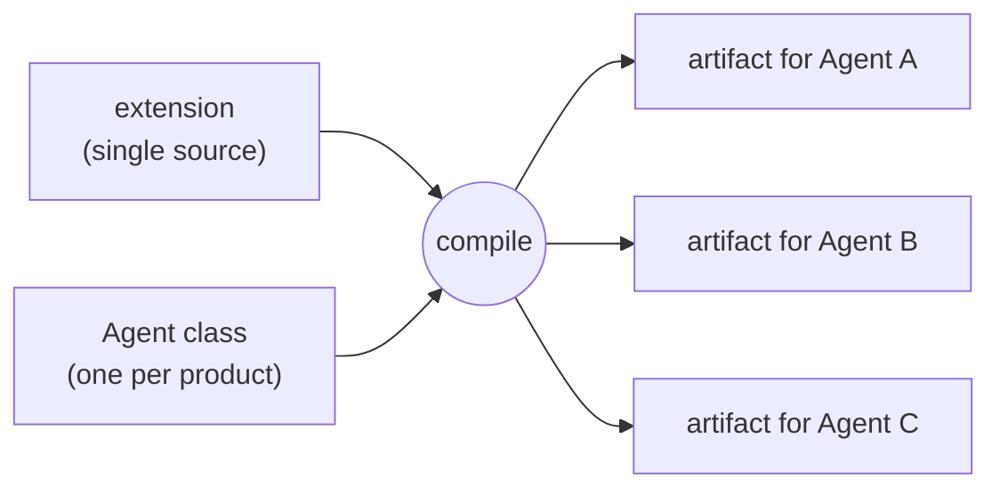

# ADR-0001: Single-source の extension を compile して multi-agent に対応する

## Status

Proposed | **Accepted** | Rejected | Superseded | Deprecated

## Context

Copilot CLI、OpenCode、Claude Code などの coding agent 製品は、skill や subagent という概念をほぼ共通に持つ。ただし、表現方法は製品ごとに異なる。

- **ファイル名と配置先**: `<name>.agent.md` と `<name>.md`、`~/.copilot` と `~/.config/opencode` と `~/.claude` など。
- **metadata の語彙と意味**: 同じ「ツール権限」が `tools`、`permission`、`allowed-tools` / `disallowed-tools` になり、許可・確認・拒否の意味づけも異なる。
- **共通規約の範囲**: 共通の skill ディレクトリ（`~/.agents/skills`）を読む製品と読まない製品がある。subagent に共通規約はない。

一方で、skill や subagent の本文（指示内容）は製品に依存しない。作者は一つの機能を一度だけ書き、複数の Agent で使いたい。製品ごとにコピーを手で保守すると、内容が少しずつずれ、どれが正なのか分からなくなる。

### 用語

本 ADR 群で使う基本的な用語を挙げる。

| 用語 | 意味 |
|---|---|
| Agent | Copilot CLI、OpenCode、Claude Code などの coding agent 製品。 |
| package | 作者が一つの機能として書く source のまとまり。一つ以上の extension を含む。 |
| extension | package を構成する type 別の要素（現在は skill または agent）。作者が書く single source の単位。 |
| artifact | extension を一つの Agent 向けに compile した結果。そのまま配置できる。 |
| Agent class | 一つの Agent 製品の規約（ファイル名、配置先、metadata の語彙）を知るツール側の class。 |

## Decision

**Agent に依存しない single source を作者が書き、Agent ごとに compile して製品固有の artifact を得る。**

作者は「何をさせたいか」を extension として一つだけ書く。それを製品ごとに「どう表すか」は、製品ごとに一つあるツール側の Agent class が知っており、compile が両者を組み合わせて Agent ごとの artifact を作る。必要であれば、作者が Agent 固有の指定を extension に書き添えることもできる。extension の中身は ADR-0002 で定める。

### 設計原則

今後の変更はこれらの原則に従う。原則を変える場合は、本 ADR を置き換える新しい ADR を書く。ADR-0002 以降は、これらの原則を具体化したものである。

- **PRI-001 Single source**: extension を唯一の正とし、原則として Agent 非依存に書く。製品ごとのコピーは持たない。
- **PRI-002 製品の知識は Agent class に閉じる**: ファイル名、配置先、metadata の語彙といった製品間の差異は Agent class だけが知る。新しい製品への対応は Agent class の追加で行い、既存の extension や compile の流れは変えない。既存の extension を変えずにその製品向けの artifact が得られることを、対応できたことの基準とする。
- **PRI-003 Agent 固有の記述は metadata の決まった場所に限る**: 作者が Agent 固有の指定を書く必要がある場合は、metadata の決まった場所に書く（ADR-0002）。本文に製品ごとの分岐を持ち込まない。
- **PRI-004 本文は変換しない**: compile が変えるのは metadata（frontmatter）、ファイル名、配置先の分類だけである。本文と同梱ファイルはそのまま渡す。
- **PRI-005 metadata の翻訳は field 単位**: Agent class は `(type, field)` ごとの規則で、一つの field の値をその Agent の表現（0 個以上の field）に変える。規則のない field はそのまま通す。
- **PRI-006 変換と判断は compile で完結する**: compile 結果は配置可能な最終形の artifact である。配置時には変換も判断もしない。

## Consequences

### Positive

- **POS-001**: 一つの機能を一度書けば、対応するすべての Agent で使える。製品ごとのコピーがずれることもない。
- **POS-002**: 新しい Agent 製品への対応は Agent class の追加で済む。既存の source を書き換える必要はない。
- **POS-003**: 翻訳規則は一つの field に閉じた小さな変換なので、Agent ごとに独立してテストできる。
- **POS-004**: 作者は、多くの場合、製品固有の規約（ファイル名、配置先、権限の語彙）を覚えなくてよい。製品固有の機能を使いたいときだけ、該当 Agent 向けの metadata を書けばよい。
- **POS-005**: compile 結果を配置前に確認・diff できる。変換の問題と配置の問題を分けて調べられる。

### Negative

- **NEG-001**: 作者とインストール先の間に変換工程が入る。利用には build と deploy が必要になる。
- **NEG-002**: 製品間で意味が完全には一致しない概念がある（例: Claude Code の subagent `tools` は許可と確認を区別しない）。compile の結果は近似になりうる。
- **NEG-003**: Agent 製品の仕様変更に合わせて、ツール側の Agent class を追従させ続ける必要がある。
- **NEG-004**: 本文は変換しないため、本文に製品固有の記述が必要な場合は単一の source では表現できない。
- **NEG-005**: 翻訳は field 単位のため、複数の field にまたがる変換は表現できない。複数の規則が同じ出力 field を生成した場合の扱いも未定義。

## Alternatives Considered

### 製品ごとに source を個別に保守

- **ALT-001**: **Description**: Agent ごとに skill / agent ファイルを用意し、手で同期する。
- **ALT-002**: **Rejection Reason**: 内容がずれやすく、正がどれか分からなくなる。対応製品が増えるほど保守の負担が増える。

### 特定製品の形式を正として他製品へ変換

- **ALT-003**: **Description**: たとえば Copilot の形式で書き、そこから他の製品の形式を生成する。
- **ALT-004**: **Rejection Reason**: source の語彙が特定製品に縛られ、その製品の仕様変更が全体に波及する。他の製品にしかない表現も扱いにくい。

### 共通規約（`~/.agents/skills` など）だけに依存

- **ALT-005**: **Description**: 変換を行わず、共通ディレクトリへのコピーや symlink だけで済ませる。
- **ALT-006**: **Rejection Reason**: 共通ディレクトリを読まない製品があり、subagent には共通規約もない。metadata の語彙の差も解消できない。

### source 内に製品ごとの条件分岐を書く（テンプレート）

- **ALT-007**: **Description**: ERB などで `if agent == ...` のように本文や frontmatter を分岐させる。
- **ALT-008**: **Rejection Reason**: 製品の知識が本文を含む source 全体に広がり、本文が単体で読める文書でなくなる。Agent 固有の記述は metadata の決まった場所（`static.agents.<agent>`）に限る方がよい。

### metadata 全体を受け取る翻訳器

- **ALT-009**: **Description**: Agent class が metadata 全体を受け取り、最終的な frontmatter を組み立てる。
- **ALT-010**: **Rejection Reason**: 優先順位や name の扱いといった共通の規則が各 Agent class に重複し、テストも難しくなる。

### 配置時にその場で変換（中間成果物なし）

- **ALT-011**: **Description**: 変換結果をファイルに残さず、配置先へ直接書き込む。
- **ALT-012**: **Rejection Reason**: 変換結果を検査できず、ファイル名や配置先の誤りを追跡しにくい。

## References

- **REF-001**: ADR-0002（extension と metadata DSL）、ADR-0003（artifact scope）、ADR-0004（外部 Agent と実行時の選択）
- **REF-002**: `README.md` 冒頭
